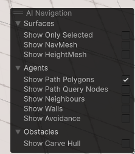

# NavMeshのGizmosを非表示にする方法

シーンビューの画面右下に表示されるAI Navigationパネルの`Surfaces > Show NavMesh`のチェックマークを外す

GameView右上のGizmosに昔はあったみたいだが、新しいNavigationパッケージに変わったタイミングでNavigationMenuだけ分離したので今の形になったみたい (真偽不明)

ゲームビューにある`Gizmos`のタブを開く必要はないので操作はしやすいが、統一感があるとは言えないので慣れるまで混乱しそう.

## 参考資料

https://discussions.unity.com/t/how-to-hide-the-navmesh-gizmo-in-2022-2/904812