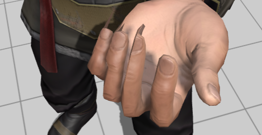

# Mixamoを使ってみた

## Mixamoとは

Adobeが提供する?3Dキャラクターとアニメーションの配布サイト.
商用利用もできる.

## 特徴

- 商用利用可能
- ダウンロードできるアニメーション・キャラクターの選択肢が多い
- FBXでダウンロードできる
- ダウンロード時にFBXの形式（ASCII・Binary・ForUnity）やフレームレート、スキンの有無などが設定できる

## Unityで扱う際の注意点

- AnimationのHumanoidが変な回転を持つことがある
- Characterのウェイト設定がおかしい

### AnimationのHumanoidが変な回転を持つことがある

Animationファイルをダウンロードし、Humanoid AvatarをAnimationファイルから作成した際に手が180度回転しているものがあった.

個々のAnimationファイルによって、Humanoid Avatarの当たり外れはあると思われる．

ただMixamoで配布されているCharacter, Animationのボーン名が統一されているっぽいので、一つ自分で修正したHumanoid Avatarを使い回すことができる.

### Characterのウェイトがおかしい場合がある

指回りで見られた。ウェイトの設定が甘く、指を曲げたときの挙動がおかしい

これはMixamoのウェブUI上でも同じ現象が見られるので元のモデルのウェイト設定に問題がある。

FBXを読み込んでウェイト設定をし直すことで修正できそう.

